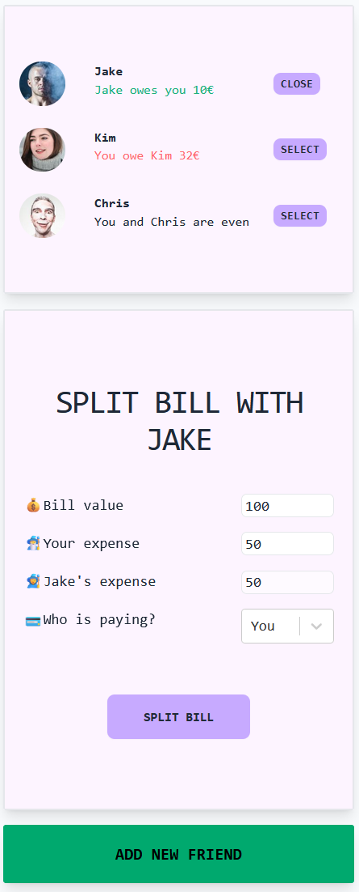

# Overview

This project has been created as part of the Ultimate React Course by Jonas Schmedtmann.

## Exercise

This project has been created as an exercise within the React course ('eat-n-split'). It has focused on core React concepts such as state, derived state, props and prop drilling (no context as of yet), controlled elements, when and how react renders etc.

## Images

